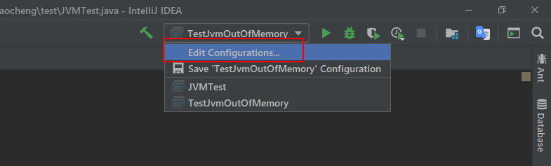

# JVM

> 作者:Cheng

****

## 1、JVM的参数

### 1.1 JVM的参数分为三种类型
    1:标准参数:
        -help
        -version
    2:-X参数(非标准参数)
        -Xint
        -Xcomp
    3:-XX参数
        -XX:newSize
        -XX:+UseSerialGc
### 1.2 标准参数
jvm的标准参数基本都比较稳定,在未来的java版本中基本不会改动,可以使用java -help来查询所有的标准参数
```
PS C:\WINDOWS\system32> java -help
用法: java [-options] class [args...]
           (执行类)
   或  java [-options] -jar jarfile [args...]
           (执行 jar 文件)
其中选项包括:
    -d32          使用 32 位数据模型 (如果可用)
    -d64          使用 64 位数据模型 (如果可用)
    -server       选择 "server" VM
                  默认 VM 是 server.

    -cp <目录和 zip/jar 文件的类搜索路径>
    -classpath <目录和 zip/jar 文件的类搜索路径>
                  用 ; 分隔的目录, JAR 档案
                  和 ZIP 档案列表, 用于搜索类文件。
    -D<名称>=<值>
                  设置系统属性
    -verbose:[class|gc|jni]
                  启用详细输出
    -version      输出产品版本并退出
    -version:<值>
                  警告: 此功能已过时, 将在
                  未来发行版中删除。
                  需要指定的版本才能运行
    -showversion  输出产品版本并继续
    -jre-restrict-search | -no-jre-restrict-search
                  警告: 此功能已过时, 将在
                  未来发行版中删除。
                  在版本搜索中包括/排除用户专用 JRE
    -? -help      输出此帮助消息
    -X            输出非标准选项的帮助
    -ea[:<packagename>...|:<classname>]
    -enableassertions[:<packagename>...|:<classname>]
                  按指定的粒度启用断言
    -da[:<packagename>...|:<classname>]
    -disableassertions[:<packagename>...|:<classname>]
                  禁用具有指定粒度的断言
    -esa | -enablesystemassertions
                  启用系统断言
    -dsa | -disablesystemassertions
                  禁用系统断言
    -agentlib:<libname>[=<选项>]
                  加载本机代理库 <libname>, 例如 -agentlib:hprof
                  另请参阅 -agentlib:jdwp=help 和 -agentlib:hprof=help
    -agentpath:<pathname>[=<选项>]
                  按完整路径名加载本机代理库
    -javaagent:<jarpath>[=<选项>]
                  加载 Java 编程语言代理, 请参阅 java.lang.instrument
    -splash:<imagepath>
                  使用指定的图像显示启动屏幕
有关详细信息, 请参阅 http://www.oracle.com/technetwork/java/javase/documentation/index.html。
```
#### 1.2.1 实战
> 查询java版本
```
PS C:\WINDOWS\system32> java -version
java version "1.8.0_181"
Java(TM) SE Runtime Environment (build 1.8.0_181-b13)
Java HotSpot(TM) 64-Bit Server VM (build 25.181-b13, mixed mode)
```
>通过-D设置参数
- 代码如下
```java
public class JVMTest {

    public static void main(String[] args) {
        String str = System.getProperty("str");
        if (str == null){
            System.out.println("zhangsan");
        }else {
            System.out.println(str);
        }
    }
}
```
- 使用IDEA编译
1. 首先把项目运行一遍,控制台会输入`zhangsan`,因为这时候没有str这个参数
2. idea运行过的项目都会在标题栏生成一个运行的快捷方式,然后我们点击Edit Configurations

3. 在弹出的窗口中`VM options`的输入栏输入`-Dstr=123`,表示运行的时候增加-D参数,然后点击确定

4. 执行程序,会发现控制台输出`123`
#### 1.2.2 -server和-client参数
可以通过-server和-client设置jvm的运行模式,他们的区别是
1. server模式的初始堆空间会比较大,JVM默认使用并行的垃圾回收器,特点是启动慢,运行快
2. client模式会相对比较保守,初始的堆内存空间会比较小,JVM默认使用串行的垃圾回收器,它的目标是为了让JVM启动的更快,但是运行效率会比server慢
3. JVM在启动的时候会根据硬件和操作系统自动选择运行方式,
4. 32位操作系统
    如果是windows系统,不论硬件配置多么好,默认都是client模式运行
    如果是其他操作系统,如果内存大于2G,并且同时有2个以上的内核,会以server模式运行,否则以client模式运行
5. 64位操作系统
    只有server模式,不支持client模式
### 1.3 -X参数

java的非标准参数,在不同的版本中参数可能不同,可以通过java -X查看非标准参数

```
PS C:\WINDOWS\system32> java -X
    -Xmixed           混合模式执行 (默认)
    -Xint             仅解释模式执行
    -Xbootclasspath:<用 ; 分隔的目录和 zip/jar 文件>
                      设置搜索路径以引导类和资源
    -Xbootclasspath/a:<用 ; 分隔的目录和 zip/jar 文件>
                      附加在引导类路径末尾
    -Xbootclasspath/p:<用 ; 分隔的目录和 zip/jar 文件>
                      置于引导类路径之前
    -Xdiag            显示附加诊断消息
    -Xnoclassgc       禁用类垃圾收集
    -Xincgc           启用增量垃圾收集
    -Xloggc:<file>    将 GC 状态记录在文件中 (带时间戳)
    -Xbatch           禁用后台编译
    -Xms<size>        设置初始 Java 堆大小
    -Xmx<size>        设置最大 Java 堆大小
    -Xss<size>        设置 Java 线程堆栈大小
    -Xprof            输出 cpu 配置文件数据
    -Xfuture          启用最严格的检查, 预期将来的默认值
    -Xrs              减少 Java/VM 对操作系统信号的使用 (请参阅文档)
    -Xcheck:jni       对 JNI 函数执行其他检查
    -Xshare:off       不尝试使用共享类数据
    -Xshare:auto      在可能的情况下使用共享类数据 (默认)
    -Xshare:on        要求使用共享类数据, 否则将失败。
    -XshowSettings    显示所有设置并继续
    -XshowSettings:all
                      显示所有设置并继续
    -XshowSettings:vm 显示所有与 vm 相关的设置并继续
    -XshowSettings:properties
                      显示所有属性设置并继续
    -XshowSettings:locale
                      显示所有与区域设置相关的设置并继续

-X 选项是非标准选项, 如有更改, 恕不另行通知。
```
### 1.3.1 -Xint -Xcomp -Xmixed
- 在解释模式下运行,-Xint标记会强制JVM执行所有的字节码文件,执行到那一行才解释那一行,这种方式启动的时候会比较快,但是这样会降低运行速度,通常低10倍,甚至更多

- -Xcomp参数刚好与-Xint相反,程序在启动的时候会把所有的直接马文件解释成本地代码,执行效率会很高,但是启动的时候会比较慢,因为要解释编译字节码文件,

  - 但是有些应用使用-Xcomp也会有一些性能损失,只是比-Xint损失小一些,因为-Xcomp没有让JVM启动所有的JIT编译器的功能,JIT编译器可以对是否需要编译做出判断,如果所有的代码都进行编译,对哪些只执行一次的代码意义不大.

- -XMixed是混合模式,将解释模式与编译模式进行混用,由JVM自己决定,这个是JVM默认的模式,也是推荐的模式.

### 1.4 -XX参数

- -XX也是非标准参数,主要用于JVM的调优和debug操作

- -XX参数使用有2种形式,一种是boolean类型,一种是非boolean类型
- boolean类型
  - 格式: -XX:[+-]
  - 如:-XX:+DisableExplicitGC表示禁用手动调用GC,就是在代码中调用`System.gc()`无效
- 非boolean类型
  - 格式:-XX:
  - 如:-XX:NewRatio=1 表我是新生代和老年代的比值

### 1.5 -Xms与-Xmx参数

-Xms和-Xmx参数是用来设置JVM堆的初始大小和最大大小的参数

-Xms512m :等价于-XX:InitialHeapSize,设置堆内存的初始大小为512M

-Xmx1024:等价于-XX:MaxHeapSize,设置堆内存的最大大小为1024M

适当的调整JVM的堆内存大小,可以充分的利用服务器的资源,让程序跑的更快

### 1.6 查看JVM的运行参数

有时候需要查看jvm的运行参数,这个时候分为两种情况:

1. 运行java程序时打印运行参数
2. 查询正在运行的java程序的运行参数

#### 1.6.1 运行java程序时打印参数

运行java命令时打印参数,需要添加`-XX:+PrintFlagsFinal`参数即可
> 参数列表太长,这里只展示一部分
```
[Global flags]
    uintx AdaptiveSizeDecrementScaleFactor     = 4      {product}
    uintx AdaptiveSizeMajorGCDecayTimeScale    = 10     {product}
    uintx AdaptiveSizePausePolicy              = 0      {product}
    uintx AdaptiveSizePolicyInitializingSteps  = 20     {product}
    uintx AdaptiveSizePolicyOutputInterval     = 0      {product}
    uintx AdaptiveSizePolicyWeight             = 10     {product}
         .........
    bool UseParallelGC                         := true  {product}
    uintx YoungGenerationSizeSupplementDecay   = 8      {product}
    uintx YoungPLABSize                        = 4096   {product}
     bool ZeroTLAB                             = false  {product}
     intx hashCode                             = 5      {product}
```

上述列表就可以看出,参数有boolean类型和数字类型,指的操作符时`=`或`:=`,`=`表示这个时默认值,`:=`表示这个值被修改过

#### 1.6.1 查看正在运行中的java程序参数

如果要查询正在运行的jvm就需要使用`jinfo`命令查看

```shell
#通过java提供的jps命令可以查看有哪些java进程
PS C:\WINDOWS\system32> jps                                                               13552 Launcher
1240 Jps
#通过jps -l可以看到进程的全量名
PS C:\WINDOWS\system32> jps -l                                                           13232 sun.tools.jps.Jps
13552 org.jetbrains.jps.cmdline.Launcher
##再通过jinfo -flags查看idea的这个进程
PS C:\WINDOWS\system32> jinfo -flags 13552                                               Attaching to process ID 13552, please wait...
Debugger attached successfully.
Server compiler detected.
JVM version is 25.181-b13
Non-default VM flags: -XX:CICompilerCount=3 -XX:InitialHeapSize=268435456 -XX:MaxHeapSize=734003200 -XX:MaxNewSize=244318208 -XX:MinHeapDeltaBytes=524288 -XX:NewSize=89128960 -XX:OldSize=179306496 -XX:+UseCompressedClassPointers -XX:+UseCompressedOops -XX:+UseFastUnorderedTimeStamps -XX:-UseLargePagesIndividualAllocation -XX:+UseParallelGC
Command line:  -Xmx700m -Djava.awt.headless=true -Djava.endorsed.dirs="" -Djdt.compiler.useSingleThread=true -Dpreload.project.path=D:/develop/idea-workspase/JVMTest -Dpreload.config.path=C:/Users/****/.IntelliJIdea2019.2/config/options -Dcompile.parallel=false -Drebuild.on.dependency.change=true -Djava.net.preferIPv4Stack=true -Dio.netty.initialSeedUniquifier=3549359702897210596 -Dfile.encoding=GBK -Duser.language=zh -Duser.country=CN -Didea.paths.selector=IntelliJIdea2019.2 -Didea.home.path=C:\Program Files\JetBrains\IntelliJ IDEA 2019.2.4 -Didea.config.path=C:\Users\****/.IntelliJIdea2019.2/config -Didea.plugins.path=C:\Users\****/.IntelliJIdea2019.2/config/plugins -Djps.log.dir=C:/Users/****/.IntelliJIdea2019.2/system/log/build-log -Djps.fallback.jdk.home=C:/Program Files/JetBrains/IntelliJ IDEA 2019.2.4/jbr -Djps.fallback.jdk.version=11.0.4 -Dio.netty.noUnsafe=true -Djava.io.tmpdir=C:/Users/****/.IntelliJIdea2019.2/system/compile-server/jvmtest_9f769294/_temp_ -Djps.backward.ref.index.builder=true -Dkotlin.incremental.compilation=true -Dkotlin.incremental.compilation.js=true -Dkotlin.daemon.enabled -Dkotlin.daemon.client.alive.path="C:\Users\****\AppData\Local\Temp\kotlin-idea-15683313314569183394-is-running"

#查看某一个参数的命令是jinfo -flag <参数名> <进程id>
PS C:\WINDOWS\system32> jinfo -flag MaxHeapSize 13552                                     -XX:MaxHeapSize=734003200
```

****

## 2. JVM的内存模型

jvm的内存模型在1.7和1.8的版本中区别较大,我这边主要学习的是1.8,但是还是需要对1.7的内存模型有所了解

### 2.1 jdk1.7的堆内存模型


其中主要分为三个部分

- Young(年轻代)
  - Young被分为三个区域分别是Eden区和两个大小严格相等的Survivor区
  - Survivor在某一时刻只有一个可以使用,另一个是在进行GC的时候用于对象的复制.
  - 在Eden区间变满的时候,GC会把存活的对象复制到Survivor区,经过几次垃圾回收以后还存活在Survivor区的对象将会被移到Tenured区
- Tenured(年老代)
  - Tenured区主要用于存放声明周期比较大的对象,**有一些大的对象,在刚创建的时候也会直接存放在年老代,不会进入年轻代**
  - 当一些对象在年轻代经历过几次GC后依然存活就会被移到年老代
  - 如果系统中使用了application级别的缓存时,缓存中的对象也会被转移到这个分区
- Perm(永久代)
  - Perm一般保存class,method,filed对象,一般不会溢出,除非一次性加载了很多类
  - 不过在设计到热部署的应用服务器的时候可能会遇到`java.lang.OutOfMemoryError:PermGen space`,原因是每次都重新部署,但是重新部署后,类的class没有被卸载掉,这样就造成了大量的class对象保存在perm分区,这种情况一般重新启动应用服务器即可
- Virtual区
  - 最大内存和初始内存的差值,就是Virtual区

### 2.2 jdk1.8的内存模型


看上面这个图就知道了,jdk1.8中的堆内存主要有两块区域组成

- 年轻代: 一个Eden区和两个Survivor区组成
- 年老代

在jdk1.8中变化最大的就是Perm区,使用了Metaspace(元数据空间)进行了替换.

**元数据空间使用的不是jvm的内存空间,直接使用的时本地的内存空间,如下图所示:**


### 2.3 为什么要废弃Perm区

> 官方给出了解释: http://openjdk.java.net/jeps/122

```text
This is part of the JRockit and Hotspot convergence effort. JRockit customers do not need to configure the permanent generation (since JRockit does not have a permanent generation) and are accustomed to not configuring the permanent generation.

移除永久代是为融合HotSpot JVM与 JRockit VM而做出的努力，因为JRockit没有永久代，不需要配置永久代。
```

现实使用中,由于永久代内存经常不够用或者发生内存泄漏,爆出异常`java.lang.OutOfMemoryError: PermGen`

基于此,就废弃了永久区,用元数据空间和本地内存代替.


### 2.4 通过jstat命令查看堆内存使用情况

jstat命令可以查看堆内存各部分的使用量,以及加载类的数量.

命令的格式如下:

```shell
jstat [-命令选项] [vmid] [间隔时间/毫秒] [查询次数]
```

#### 2.4.1 查看class加载统计

```shell
PS C:\WINDOWS\system32> jstat -class 13552                                              Loaded  Bytes  Unloaded  Bytes     Time
3231    6180.9        0     0.0    0.93
```

- Loaded:加载class的数量
- Bytes:所占空间的大小
- Unloaded:未加载的数量
- Bytes:未加载的所占的空间
- Time:时间

#### 2.4.2 查看编译统计

```shell
PS C:\WINDOWS\system32> jstat -compiler 13552                                             Compiled  Failed  Invalid   Time   FailedType FailedMethod
    1040      0       0     0.82          0
```

- Compiled:编译的数量
- Failed:失败的数量
- Invalid:不可用数量
- Time:时间
- FailedType:失败类型
- FailedMethod:失败的方法

#### 2.4.3 垃圾回收的统计

```shell
PS C:\WINDOWS\system32> jstat -gc 13552                                                   S0C    S1C    S0U    S1U      EC       EU        OC         OU       MC     MU    CCSC   CCSU   YGC     YGCT    FGC    FGCT     GCT
10752.0 10752.0  0.0   5985.2 65536.0   5046.0   175104.0    144.0    18432.0 17812.5 2304.0 2070.1      1    0.007   0      0.000    0.007
```

- S0C:第一个Survivor区的大小,单位KB
- S1C:第二个Survivor区的大小
- S0U:第一个Survivor区已使用的大小
- S1U:第二个Survivor区已使用的大小
- EC:Eden区的大小
- EU:Eden区已使用的大小
- OC:Old区的大小
- OU:Old已使用的大小
- MC:方法区大小
- MU:方法区使用的大小
- CCSC:压缩类空间大小
- CCSU:压缩类已使用空间的大小
- YGC:年轻代垃圾回收次数
- YGCT:年轻代垃圾回收消耗的时间
- FGC:老年代回收次数
- FGCT:老年代回收消耗时间
- GCT:垃圾回收消耗总时间

## 3. jmap的使用以及内存溢出分析

前面使用jstat可以对jvm堆的内存进行统计分析,而jmap可以获取到更加详细的内容,

如:内存的使用情况汇总,堆内存溢出的定位和分析.

### 3.1查看内存的使用情况

```shell
PS C:\WINDOWS\system32> jmap -heap 13552                                         Attaching to process ID 13552, please wait...
Debugger attached successfully.
Server compiler detected.
JVM version is 25.181-b13

using thread-local object allocation.
Parallel GC with 4 thread(s)

Heap Configuration: #堆内存配置信息
   MinHeapFreeRatio         = 0
   MaxHeapFreeRatio         = 100
   MaxHeapSize              = 734003200 (700.0MB)
   NewSize                  = 89128960 (85.0MB)
   MaxNewSize               = 244318208 (233.0MB)
   OldSize                  = 179306496 (171.0MB)
   NewRatio                 = 2
   SurvivorRatio            = 8
   MetaspaceSize            = 21807104 (20.796875MB)
   CompressedClassSpaceSize = 1073741824 (1024.0MB)
   MaxMetaspaceSize         = 17592186044415 MB
   G1HeapRegionSize         = 0 (0.0MB)

Heap Usage:#堆内存使用情况
PS Young Generation#年轻代
Eden Space:
   capacity = 67108864 (64.0MB)
   used     = 5167056 (4.9276885986328125MB)
   free     = 61941808 (59.07231140136719MB)
   7.6995134353637695% used
From Space:
   capacity = 11010048 (10.5MB)
   used     = 6128816 (5.8448944091796875MB)
   free     = 4881232 (4.6551055908203125MB)
   55.66566103980655% used
To Space:
   capacity = 11010048 (10.5MB)
   used     = 0 (0.0MB)
   free     = 11010048 (10.5MB)
   0.0% used
PS Old Generation#年老代
   capacity = 179306496 (171.0MB)
   used     = 147488 (0.140655517578125MB)
   free     = 179159008 (170.85934448242188MB)
   0.08225468864217836% used

5109 interned Strings occupying 438216 bytes.
```

### 3.2 查看内存中对象的数量及大小

```shell
#查看所有对象,包括活跃的和非活跃的
jmap -histo <pid> | more
#查看活跃对象
jmap -histo:live <pid> | more

PS C:\WINDOWS\system32> jmap -histo:live 13552 | more                                                                   
 num     #instances         #bytes  class name
----------------------------------------------
   1:         10665        1066960  [C
   2:           847         682912  [B
   3:          3481         387696  java.lang.Class
   4:          2683         312888  [Ljava.lang.Object;
   5:         10432         250368  java.lang.String
   6:          6676         213632  java.util.concurrent.ConcurrentHashMap$Node
   7:          6088          97408  java.lang.Object
   8:          1388          71400  [I
   9:            48          61088  [Ljava.util.concurrent.ConcurrentHashMap$Node;
  10:            78          41184  io.netty.util.internal.shaded.org.jctools.queues.atomic.MpscAtomicArrayQueue
  11:          1250          40000  java.util.HashMap$Node
  12:           838          33520  java.util.TreeMap$Entry
  13:           433          27712  io.netty.buffer.PoolSubpage
  14:           571          22840  java.lang.ref.SoftReference
  15:           157          20016  [Ljava.util.HashMap$Node;
  16:           364          18016  [Ljava.lang.String;
  17:           268          17152  java.net.URL
  18:           497          15904  java.util.Hashtable$Entry
  19:           283          15848  java.lang.invoke.MemberName
  20:           386          15440  java.lang.ref.Finalizer
  ..........
  #对象说明
  B byte
  C char
  D double
  F float
  I int
  J long
  Z boolean
  [ 数组,如[I表示int[]
  [L+类名 其他对象
```

### 3.3 将内存使用情况dump到文件中

有时候我们需要将jvm的内存使用情况dump到文件中,然后对它进行分析,jmap也是支持的

```shell
#用法:
jmap -dump:format=b,file=dumpFileName <pid>

#示例:
jmap -dump:format=b,file=d:/temp/dump.dat 13552
```


